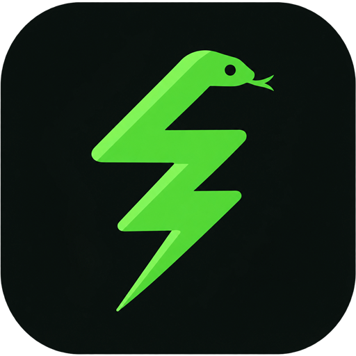
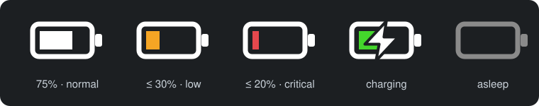

<p align="center">
  
</p>

<h1 align="center">Snake Charger</h1>

<p align="center">
  <b>Razer mouse battery level in your Windows tray. Low battery alerts. No Synapse.</b>
</p>

<p align="center">
  <a href="https://github.com/va0z-code/razer-battery-tray/releases/latest/download/SnakeCharger-Setup.exe">
    
  </a>
</p>

<p align="center">
  <a href="https://github.com/va0z-code/razer-battery-tray/releases/latest"></a>
  <a href="https://github.com/va0z-code/razer-battery-tray/releases"></a>
  
  <a href="LICENSE"></a>
</p>

<p align="center">
  <sub>Prefer no installer? Get the <a href="https://github.com/va0z-code/razer-battery-tray/releases/latest/download/SnakeCharger-portable.exe">portable .exe</a>.</sub>
</p>

---

**Snake Charger** is a tiny, free, open-source Windows tray app that shows the battery level of your wireless Razer mouse and warns you before it dies. It talks to the mouse directly over USB HID, so you don't need Razer Synapse running in the background.

<p align="center">
  
</p>

## Why Snake Charger exists

My Razer mouse kept dying in the middle of the day with no warning. The only official way to see its charge is Razer Synapse: a heavy background suite that eats memory just to show a number you have to go looking for.

So I asked Razer for two simple things:

1. A notification when the battery is running low.
2. A tray icon that actually shows the charge level.

They didn't reply. Not a "no", not a "we'll consider it". Nothing.

So much for **"For Gamers. By Gamers."**

So I built it myself. Snake Charger does exactly those two things, stays out of your way, and doesn't need Synapse at all.

## Features

- **Battery level right in the tray.** The icon is a battery glyph that follows your taskbar theme: orange at 30% and below, red at 20% and below, green with a bolt while charging, gray when the mouse is asleep. Hover to see the exact percentage.
- **Low battery notifications.** At 30%: right away, then after 5, 10, 15, 20, 25 and 30 minutes, then every 30 minutes. At 5% and below: every 5 minutes. Plugging in the cable stops them.
- **Game-aware.** No pop-ups while a fullscreen game or presentation is running. A missed reminder is shown once after you exit the game.
- **Quiet.** Switching between wired and wireless doesn't spam Connected/Disconnected toasts.
- **No Synapse, no account, no telemetry.** One small native executable written in Rust.
- **Starts with Windows.** The installer sets up autostart and a Start menu shortcut.
- Tray menu: **Refresh now** and **Exit**. That's it.

## Install

1. **[Download SnakeCharger-Setup.exe](https://github.com/va0z-code/razer-battery-tray/releases/latest/download/SnakeCharger-Setup.exe)**
2. Run it. No admin rights are needed.
3. The battery icon appears in the tray. If you don't see it, click the **^** arrow next to the clock and drag the icon onto the taskbar.

> **"Windows protected your PC"?** Snake Charger is not code-signed yet, so SmartScreen may warn about an unknown publisher. Click **More info → Run anyway**. The source code is right here, and every release is built by [GitHub Actions](https://github.com/va0z-code/razer-battery-tray/actions) with SHA-256 checksums attached.

**Uninstall:** Settings → Apps → Installed apps → Snake Charger → Uninstall.

## Supported devices

| Device                                                     | USB VID:PID |
| ---------------------------------------------------------- | ----------- |
| Razer DeathAdder V4 Pro (Wired)                            | 1532:00BE   |
| Razer DeathAdder V4 Pro (Wireless)                         | 1532:00BF   |
| Razer DeathAdder V3 Pro (Wired)                            | 1532:00B6   |
| Razer DeathAdder V3 Pro (Wireless)                         | 1532:00B7   |
| Razer DeathAdder V3 HyperSpeed (Wired)                     | 1532:00C4   |
| Razer DeathAdder V3 HyperSpeed (Wireless)                  | 1532:00C5   |
| Razer DeathAdder V2 Pro (Wired)                            | 1532:007C   |
| Razer DeathAdder V2 Pro (Wireless)                         | 1532:007D   |
| Razer Basilisk V3 Pro (Wired)                              | 1532:00AA   |
| Razer Basilisk V3 Pro (Wireless)                           | 1532:00AB   |
| Razer Basilisk V3 Pro 35K (Wired)                          | 1532:00CC   |
| Razer Basilisk V3 Pro 35K (Wireless)                       | 1532:00CD   |
| Razer Basilisk V3 Pro 35K Phantom Green Edition (Wired)    | 1532:00D6   |
| Razer Basilisk V3 Pro 35K Phantom Green Edition (Wireless) | 1532:00D7   |
| Razer Viper Ultimate (Wired)                               | 1532:007A   |
| Razer Viper Ultimate (Wireless)                            | 1532:007B   |
| Razer Orochi V2 (Receiver)                                 | 1532:0094   |
| Razer Orochi V2 (Bluetooth)                                | 1532:0095   |

Your mouse isn't listed? [Open an issue](https://github.com/va0z-code/razer-battery-tray/issues/new) with the model name, or add it yourself (see [Adding a device](#adding-a-device)). Pull requests are welcome.

## FAQ

**Do I need Razer Synapse?**
No. Snake Charger reads the battery level directly from the mouse over USB HID.

**How do I see the exact percentage?**
Hover over the tray icon.

**Does it work with Razer keyboards or headsets?**
Not yet. Only the mice listed above are supported right now.

**Does it collect any data?**
No. It makes no network requests at all.

**Where are the settings?**
There aren't any yet. The defaults are the thresholds described in [Features](#features).

## Build from source

You need [Rust](https://www.rust-lang.org/) and [Git](https://git-scm.com/).

```bash
git clone https://github.com/va0z-code/razer-battery-tray.git
cd razer-battery-tray
cargo build --release
```

The executable is at `target/release/snake-charger.exe`. To build the installer, install [Inno Setup 6](https://jrsoftware.org/isinfo.php) and run `iscc installer/snake-charger.iss`.

### Testing notifications

Run the app with these flags to try the notifications without draining your mouse:

| Flag                     | Effect                                                              |
| ------------------------ | ------------------------------------------------------------------- |
| `--simulate-battery <N>` | Report N% for every device (adds a fake mouse if none is connected) |
| `--simulate-game`        | Behave as if a fullscreen game is running                           |
| `--fast-reminders`       | Reminder schedule runs in seconds instead of minutes                |

Example: `snake-charger.exe --simulate-battery 23 --fast-reminders` shows the whole reminder chain in about two minutes.

## Adding a device

1. Add the device with `name`, `pid`, `interface`, `usage_page` and `usage` to [devices.rs](src/devices.rs).
2. Add its `transaction_id` to the match in `DeviceInfo` in [devices.rs](src/devices.rs).

You can find the PID and other values in [openrazer](https://github.com/openrazer/openrazer/blob/master/driver/razermouse_driver.h).

## Credits

Snake Charger is based on [razer-battery-report](https://github.com/xzeldon/razer-battery-report) by [xzeldon](https://github.com/xzeldon) and its contributors, released under the MIT license.

- [openrazer](https://github.com/openrazer/openrazer): Linux drivers for Razer devices
- [razer-battery-checker](https://github.com/spozer/razer-battery-checker): the original Python script
- [Elem](https://github.com/Fuwn/elem): Logitech battery level tray indicator

## Disclaimer

Snake Charger is an independent project. It is not affiliated with, endorsed by, or sponsored by Razer Inc. Razer, Synapse, DeathAdder, Basilisk, Viper and Orochi are trademarks of Razer Inc.

## License

[MIT](LICENSE)
